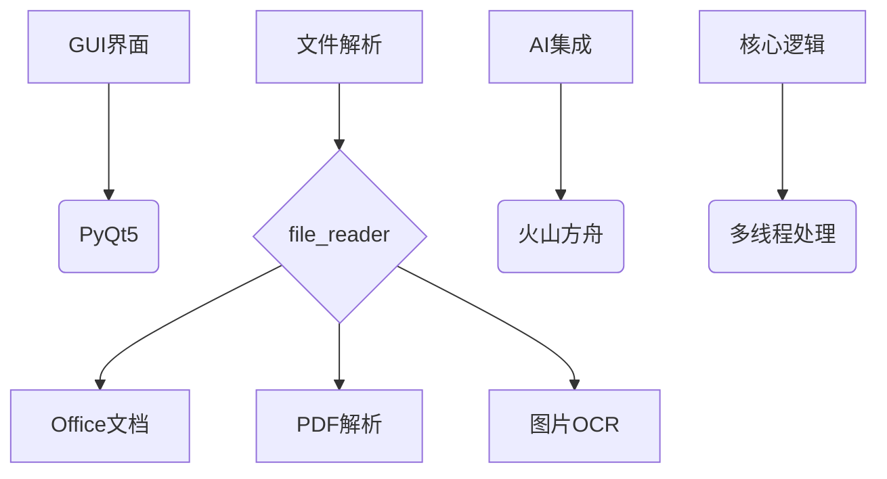

# 文件批量处理工具


## 🌟 功能特性

- **多格式支持**  
  支持处理 `.docx`, `.xlsx`, `.pptx`, `.pdf`, `.txt` 及主流图片格式（.jpg/.png等）
  
- **智能重命名**  
  通过AI提取文件生成时间与核心内容，按`yyyymmdd_标题.扩展名`格式自动重命名

- **PDF高级处理**  
  - 智能分割多页PDF为独立文件
  - 可视化布局分析（实验性功能）

- **批量处理**  
  支持多线程/单线程模式，自动生成处理统计报告

- **进度可视化**  
  实时进度条+日志记录，处理状态一目了然

## 🛠️ 技术栈



## 📥 安装指南

### 环境要求
- Python 3.8+
- GPU推荐（加速OCR处理）

### 快速安装
```bash
# 安装主依赖
pip install -r requirements.txt

# 安装PaddleOCR附加组件（需单独安装）
pip install paddlepaddle paddleocr --upgrade
```

### 配置文件设置
1. 创建 `pw.py` 文件
2. 填入火山接口凭证：
```python
# pw.py
API_KEY = "your_api_key_here"        # 从火山控制台获取
BASE_URL = "https://ark.cn-beijing.volces.com/api/v3"
MODEL_NAME = "your_model_name_here"  # 推荐使用最新版本模型
```

## 🚀 使用手册

### 启动应用
```bash
python main.py
```

### 操作流程
1. 主界面点击「选择文件夹」
2. 选择处理模式：
   - 🔍 仅内容识别
   - ✂️ 仅PDF分割 
   - ⚡ 组合处理（分割+识别）
3. 查看实时进度条
4. 处理完成查看统计报告

### 输出示例
```
处理报告 - 2024-03-20
──────────────────────
✅ 成功处理: 23 文件
⏱️ 总耗时: 1m 28s
📊 平均速度: 0.63s/文件
```

## ⚙️ 高级配置

### 性能调优
```python
# 在FileProcessor类中调整
self.max_workers = 4  # CPU核心数×2为推荐值
self.ocr_threads = 1  # PaddleOCR线程限制
```

### 日志管理
```bash
tail -f app.log  # 实时监控日志
grep "ERROR" app.log  # 查看错误记录
```

## 📌 注意事项

1. **文件备份**  
   处理前自动创建 `原文件名.bak` 备份

2. **API限制**  
   火山接口默认500次/日调用限制

3. **特殊字符处理**  
   自动过滤 `\/:*?"<>|` 等非法字符